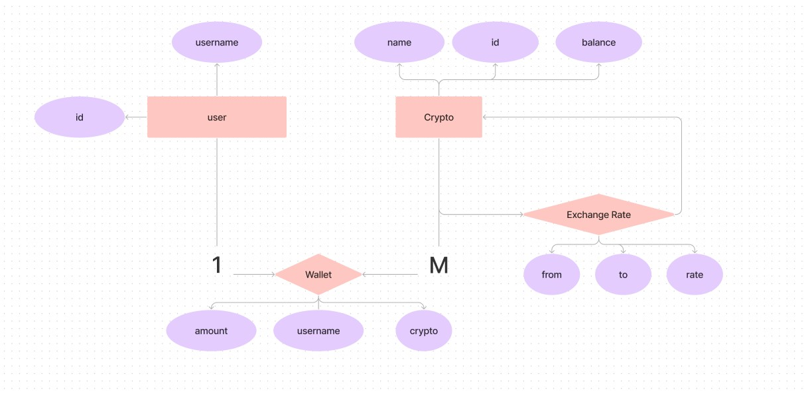
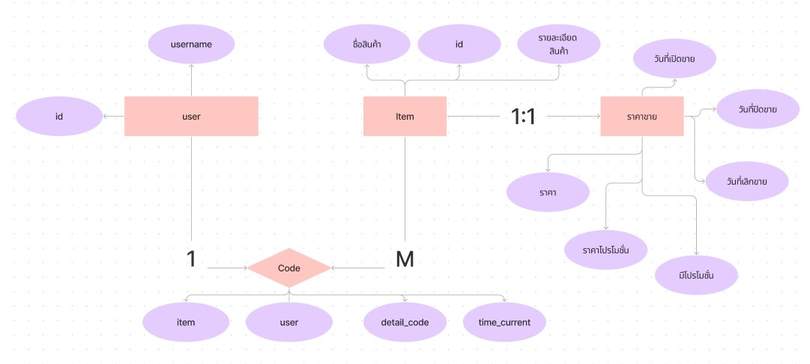

# Module APP
  * Start Server
  * Story
  * Database
## Start Server
1. run docker compose in /app/database
```bash
  docker compose up
```
2. run Server in /app
```bash
  node index.js
```
3. run test in /app
```bash
  npm test
```
## Story
#### Admin can increase and decrease user cryptocurrency balance.
* POST /admin/:crypto/:change/:balance
* Response Body
```json
{
  "id": 1,
  "namecrypto": "Bitcoin",
  "balance": 4900
}
```
#### Admin can see all total balance of all cryptocurrency.
* GET /admin/totalBalance
* Response Body
```json
[
  {
    "total_balance": 5900
  }
]
```
#### Admin can add other cryptocurrency such XRP, EOS, XLM to wallet.
* POST /admin/add/:crypto/:balance
* Response Body
```json
  "Complete insert"
```
#### Admin can manage exchange rate between cryptocurrency.
* POST /admin/addExchangeRate/:From/:To/:Rate
* Response Body
```json
  "Complete insert"
```
#### User can transfer same cryptocurrency to other.
* PUT /:user1/transfer/:user2
* Response Body
```json
{
  "username": "B",
  "namecrypto": "Ethereum",
  "amount": 1.975
}
```
## Database



# Module Database
  * Start Server
  * Database
## Start Server
1. run docker compose in /database/database
```bash
  docker compose up
```
2. run Server in /database
```bash
  node index.js
```
## Database

